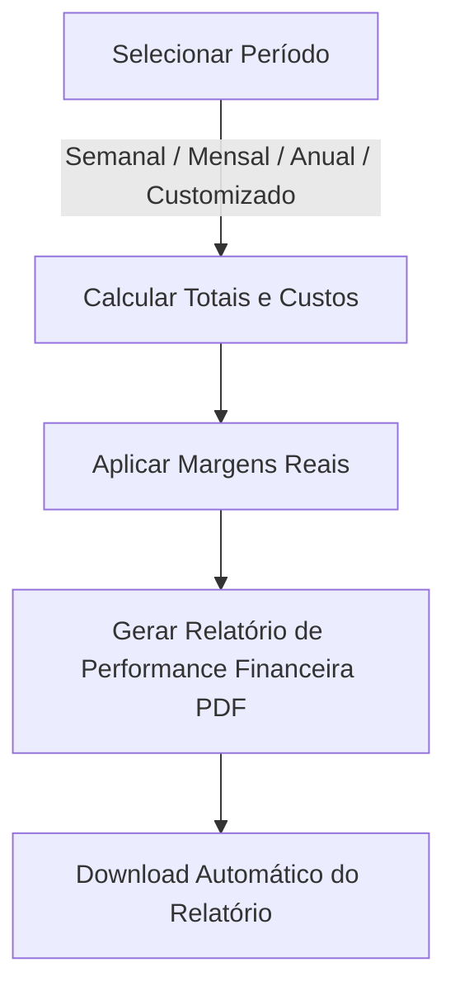
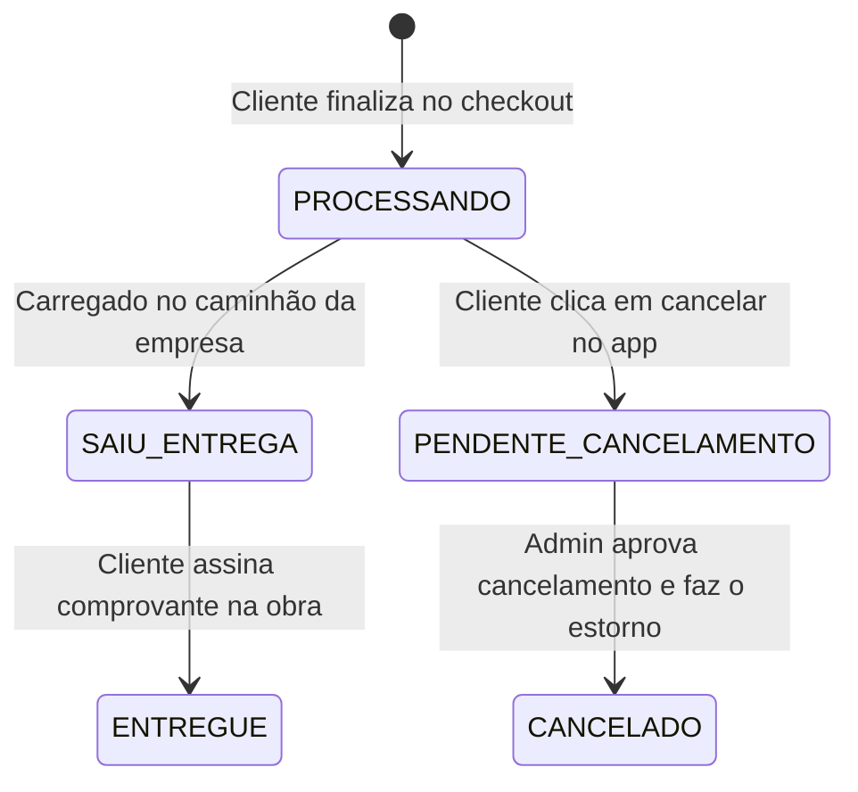

# 🏗️ Manual Administrativo Completo - Natan Construções
Este manual prático serve como guia oficial de treinamento e operação para a equipe administrativa da **Natan Construções**. Ele detalha minuciosamente todas as telas do Painel Administrativo (`/admin`), o funcionamento de cada formulário, regras de negócio e os fluxos completos do sistema.

---

## 🔑 1. Credenciais de Acesso
Para acessar o Painel Administrativo, você deve acessar a rota `/admin` ou `/login` em seu navegador.

> [!IMPORTANT]
> **Dados de Acesso Oficiais do Administrador:**
> *   **URL do Painel:** `https://seudominio.com.br/login` (ou `/admin` para redirecionamento)
> *   **E-mail de Login:** `AdminNatan@gmail.com`
> *   **Senha:** `AdminNatan2761`

---

## 📊 2. Tela de Dashboard (Painel Geral)
O Dashboard é a central de comando estratégico da Natan Construções. Aqui, o administrador tem uma visão ampla da saúde financeira e logística da loja em tempo real.

### Componentes e Métricas:
1.  **Faturamento Total:** Soma do valor de todos os pedidos finalizados ou em processamento (exclui cancelados).
2.  **Lucro Estimado:** Diferença real calculada entre o preço cobrado do cliente e o preço de custo (`costPrice`) de cada material.
3.  **Vendas Hoje:** Volume financeiro faturado especificamente no dia de hoje.
4.  **Ticket Médio:** O valor médio gasto por cliente a cada compra finalizada.
5.  **Gráfico de Vendas Semanal:** Linha contínua azul que demonstra o desempenho financeiro dos últimos 7 dias.
6.  **Gráfico Semestral:** Barras comparativas que colocam lado a lado o Faturamento vs Lucro dos últimos 6 meses.
7.  **Alerta de Estoque Crítico:** Lista suspensa destacando produtos com **estoque igual ou menor que 5 unidades**, alertando para a necessidade de reposição junto aos fornecedores.

---

### 📊 Relatório Financeiro Inteligente (Geração de PDFs)
No topo do Dashboard, há um painel dinâmico para exportar demonstrativos contábeis.

*   **Filtros de Período:**
    *   **Semanal:** Filtra os dados dos últimos 7 dias.
    *   **Mensal:** Filtra os dados dos últimos 30 dias.
    *   **Anual:** Filtra todas as transações realizadas no ano atual.
    *   **Período Personalizado:** Abre dois calendários interativos para selecionar a **Data Inicial** e **Data Final** precisas.
*   **Ação (Exportar Relatório PDF):** Gera um PDF oficial contendo o cabeçalho oficial da empresa, resumo dos principais indicadores financeiros (lucro líquido estimado, faturamento e margem média do período) e uma tabela detalhada com cada pedido faturado.

---

## 📦 3. Tela de Gestão de Produtos
Caminho no painel: `/admin/produtos`

Vitrine de materiais da Natan Construções. Nela, o administrador pode listar, cadastrar, editar e excluir itens.

### Formulário de Cadastro / Edição:
Ao clicar em **"Novo Produto"** (ou no ícone de lápis de algum item já existente), o formulário lateral exibe os seguintes campos obrigatórios:

| Campo | Tipo | Descrição e Regra de Negócio |
| :--- | :--- | :--- |
| **Nome** | Texto | Ex: `Cimento Poty CPII-Z 50 Kg`. Deve ser claro para o cliente. |
| **Categoria** | Seleção | Menu com as categorias cadastradas (ex: Cimentos, Tijolos). |
| **Custo de Compra (R$)** | Número (Dec.) | **Preço de Custo (`costPrice`):** O valor que você paga ao fornecedor. Essencial para o cálculo de lucros reais do Dashboard. |
| **Preço de Venda Base (R$)** | Número (Dec.) | O valor padrão que o produto custa para o cliente. |
| **Porcentagem de Desconto (%)** | Número | Se o produto estiver em oferta (ex: `10` para 10% de desconto). O sistema calcula o preço final sozinho. |
| **Peso Unitário (Kg)** | Número (Dec.) | **Muito Importante!** O peso é utilizado para calcular o frete dinâmico no carrinho (frete por Kg). |
| **Estoque** | Número (Int) | Quantidade de sacos/unidades disponíveis para venda imediata. |
| **Descrição** | Texto Longo | Ficha técnica e recomendações de aplicação do material. |
| **Foto do Produto** | Imagem | Upload direto de imagem. Se deixado em branco, utiliza uma imagem padrão de materiais de construção. |

---

## 🏷️ 4. Tela de Gestão de Categorias
Caminho no painel: `/admin/categorias`

Agrupa os materiais na loja para que os clientes os encontrem facilmente na página inicial.

*   **Cadastro:** Insira o nome da categoria (ex: `Ferragens`) e o sistema gera o slug (endereço URL limpo) sozinho.
*   **Edição/Exclusão:** Se você excluir uma categoria, os produtos a ela vinculados continuarão existindo, mas ficarão sem categoria mãe até que você os edite.

---

## 🛒 5. Tela de Gestão de Pedidos (O Fluxo Principal)
Caminho no painel: `/admin/pedidos`

É o coração operacional da loja. Aqui você acompanha as solicitações dos clientes e gerencia a entrega dos materiais.

### Fluxo de Status de um Pedido:

1.  **PROCESSANDO (Aguardando Separação):** O pedido acaba de chegar do checkout. O estoque já foi reservado. A equipe comercial deve separar a carga (ex: separar 10 sacos de cimento).
2.  **SAIU PARA ENTREGA (Carga em Trânsito):** A carga foi carregada no caminhão da empresa ou está pronta para ser retirada pelo cliente na loja.
3.  **ENTREGUE (Finalizado):** O caminhão retornou com o comprovante de entrega assinado. O fluxo operacional deste pedido está concluído.
4.  **PENDENTE DE CANCELAMENTO (Atenção):** O cliente solicitou o cancelamento no seu painel pessoal. O card do pedido piscará em **amarelo pulsante**. Você deve entrar em contato com ele no WhatsApp para tratar do estorno antes de cancelar no sistema.
5.  **CANCELADO (Estornado/Finalizado):** O pedido foi desfeito. A ação é **irreversível**. O estoque retorna automaticamente para a loja e o card fica bloqueado com borda vermelha.

### Recursos e Emissão de Documentos por Pedido:
Ao expandir qualquer card de pedido, o painel disponibiliza duas ferramentas cruciais de expedição:

*   **Baixar Orçamento PDF:** Gera instantaneamente a via de orçamento (Blueprint) em azul escuro e laranja, ideal para anexar como controle interno ou enviar por e-mail para o setor comercial.
*   **Gerar Nota Fiscal (Recibo/Auxiliar de Venda):** Gera uma via contendo todos os dados do cliente, campos de frete, peso e **linhas pontilhadas oficiais para assinatura do recebedor na obra** e do entregador da Natan Construções.

---

## 🎁 6. Tela de Gestão de Cupons
Caminho no painel: `/admin/cupons`

Permite criar incentivos de vendas e promoções focadas para os clientes usarem no fechamento do carrinho.

### Como criar cupons:
No formulário de cadastro, preencha:
1.  **Código do Cupom:** O termo que o cliente vai digitar (ex: `NATAN10` ou `SEMFRETE`).
2.  **Validade (Expira em):** Data limite para uso (Opcional).
3.  **Escolha do Tipo de Benefício:**
    *   **Cupom de Porcentagem:** Insira o valor em porcentagem no campo **Desconto (%)** (ex: `15` para dar 15% de desconto sobre o subtotal de produtos).
    *   **Cupom de Frete Grátis:** Ative a caixinha **"Ativar Frete Grátis neste Cupom"**. Ao fazer isso, o campo de desconto some automaticamente e o cupom passará a zerar o valor de frete logístico no checkout do cliente!

---

## 🖼️ 7. Tela de Gestão de Banners
Caminho no painel: `/admin/banners`

Controla o visual do carrossel principal da página inicial.

*   **Campos do Banner:** Imagem (dimensões recomendadas de banner panorâmico), Título sobreposto (Opcional), Texto do Botão (Opcional) e Link de Redirecionamento (ex: linkar para a categoria `/produtos?categoria=ferramentas`).
*   **Controle Ativo/Inativo:** Você pode desativar temporariamente um banner de promoção sem precisar deletá-lo.

---

## 🚀 8. O Fluxo de Venda de Ponta a Ponta: Como Operar?

Para garantir a melhor experiência para o seu cliente e manter o seu caixa organizado, siga este fluxo padrão de operação:

1.  **O Cliente faz a simulação:** Ele insere os materiais no carrinho, digita o CEP, o sistema calcula o frete proporcional e ele clica em "Confirmar Pedido".
2.  **Redirecionamento ao WhatsApp:** O cliente é redirecionado ao WhatsApp de vendas da Natan Construções com a mensagem premium contendo o ID do pedido, os produtos e o total.
3.  **Fechamento Financeiro:** Você atende o cliente no WhatsApp, confirma os dados de entrega, as observações (ex: condomínio, bloco) e envia o seu **código Pix, link de cartão ou combina o pagamento na maquininha na entrega**.
4.  **Emissão e Separação de Carga:** No Painel do Administrador, vá em **Pedidos**, expanda o pedido dele, clique em **"Gerar Nota Fiscal"** para imprimir o recibo de entrega que vai com o motorista do caminhão.
5.  **Despacho da Carga:** Mude o status do pedido no painel para **"Saiu para Entrega"**.
6.  **Finalização:** Quando o motorista retornar com o canhoto assinado pelo cliente, altere o status para **"Entregue"** para computar o faturamento definitivo no seu Dashboard financeiro.

---

## 🔄 9. Funcionamento do WhatsApp e Controle Automatizado de Estoque

Para evitar falhas humanas e garantir que o seu controle de materiais esteja sempre perfeito, o sistema possui processos automatizados para os fluxos de fechamento de venda e cancelamento:

### A. Fluxo de Venda (WhatsApp & Estoque)
1.  **No Checkout:** Ao clicar em "Confirmar Pedido", o pedido é gravado no banco de dados como `PROCESSANDO`.
2.  **Dedução de Estoque Automática:** A API do sistema varre os itens comprados e **subtrai automaticamente** as quantidades compradas do estoque de cada produto cadastrado.
3.  **Formalização no WhatsApp:** O cliente é redirecionado ao WhatsApp comercial da loja com a **Mensagem de Compra Premium** contendo os detalhes do pedido, frete, endereço, e a identificação visual de qualquer cupom aplicado (porcentagem ou frete grátis).
4.  **Emissão de NF:** O administrador imprime a Nota Fiscal/Recibo no painel e realiza a expedição.

---

### B. Fluxo de Cancelamento (WhatsApp & Estoque)
1.  **Solicitação do Cliente:** O cliente acessa seu perfil pessoal e, se o pedido ainda não tiver saído para entrega, clica em **"Solicitar Cancelamento"**.
2.  **Justificativa Obrigatória:** O cliente preenche obrigatoriamente um formulário explicando o motivo (ex: *"errei a quantidade"*). O pedido muda para `PENDENTE_CANCELAMENTO`.
3.  **Aviso no WhatsApp:** O WhatsApp do cliente abre automaticamente enviando uma **Mensagem de Cancelamento Premium** com a justificativa técnica para o seu suporte.
4.  **Visualização no Painel:** O card do pedido pisca em **amarelo pulsante** no seu painel administrativo.
5.  **Aprovação e Restauração de Estoque:** Assim que o administrador altera o status do pedido para **`CANCELADO`** no painel:
    *   O status vira definitivo (card com borda vermelha e bloqueado).
    *   **O sistema devolve/restaura automaticamente** todos os produtos daquele pedido de volta ao estoque da loja de forma 100% autônoma!
    *   Se um pedido cancelado for reativado por engano pelo administrador, o estoque é debitado novamente para garantir a integridade dos dados.
